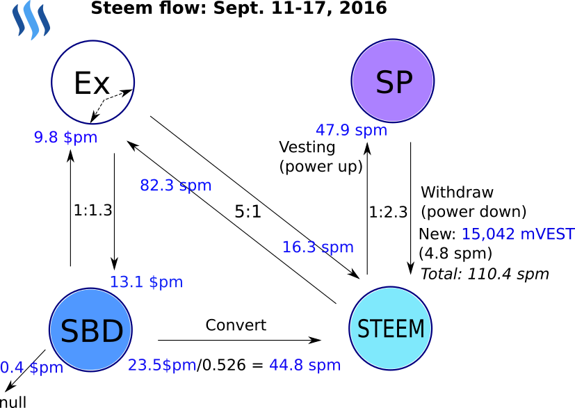

# steem-flow.py

* https://steemit.com/@fooblic

Online transaction monitoring starting from last block in STEEM blockchain and calculate average STEEM & SBD flows intensity and ratio.

spm - STEEM per minute

$pm - SBD per minute

Output example:
```
block_interval: 3 
 from_last_block: 5116714 timestamp: 2016-09-19T21:34:48 

 current_block: 5144306 (#27592) time_stamp: 2016-09-20T20:41:30 (23:06:42, 1386.7 minutes passed) 

 pow2_count: 1314 (avg: 21.0 blocks), each 0:01:03.319635 

 transfers: 1110 
 to_exchange: 184 (71911.2 STEEM @ 51.9 spm, 43166.3 SBD @ 31.1 $pm) 
 from_exchange: 90 (46337.0 STEEM @ 33.4 spm, 20274.0 SBD @ 14.6 $pm) 
 to/from exchange ratio: 1.6:1 STEEM, 2.1:1 SBD 
 between_users: 670 
 between_exchanges: 43 
 to_null: 123 (408.4 SBD) @ 0.3 $pm 

 vesting: 220 (43179.8 STEEM) @ 31.1 spm 
 new withdraw: 41 (498.3 mVESTS) @ 475.4 VESTS per min 

 convert: 50 (12847.0 SBD) @ 9.3 $pm 
 feed base: 256 (0.440 SBD), each 0:05:23.824219
```

Graphical representation of STEEM blockchain flows:

