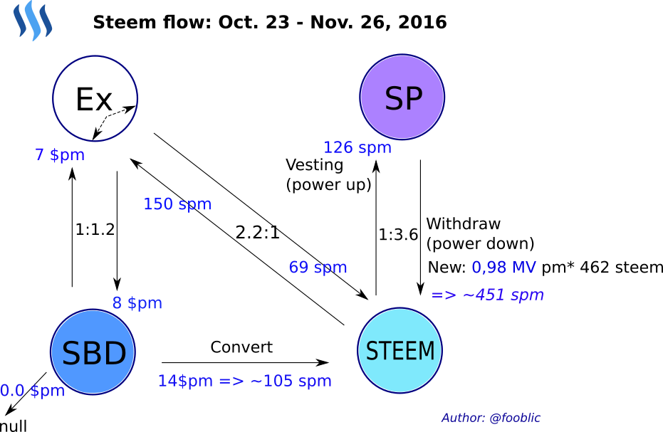
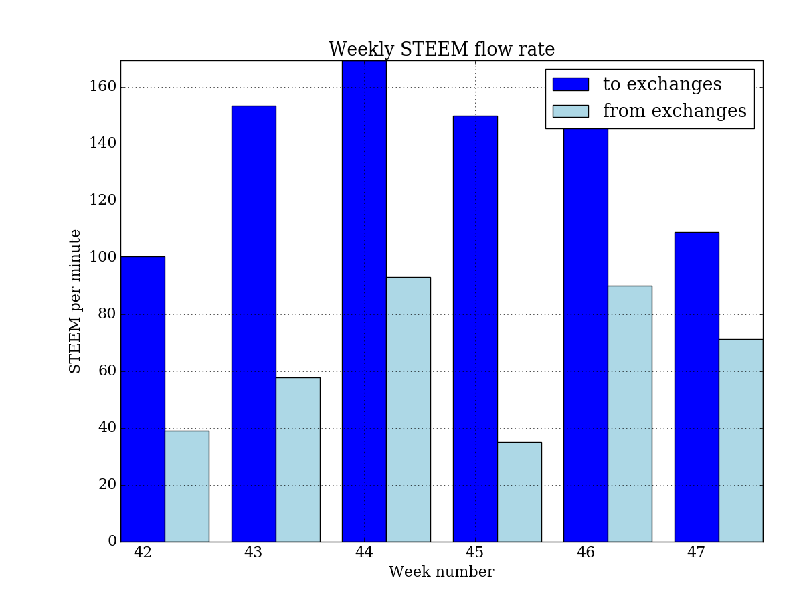
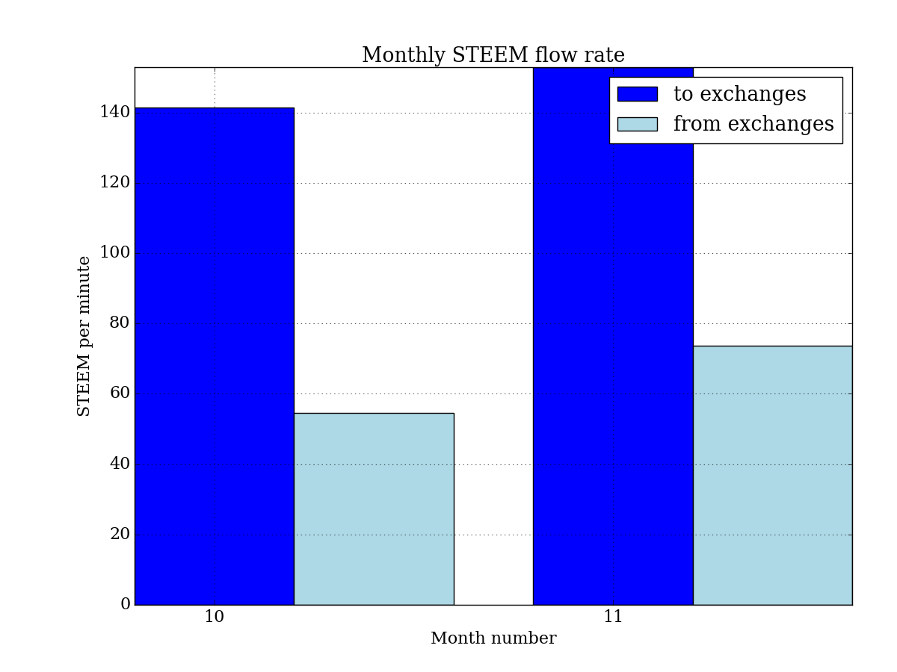
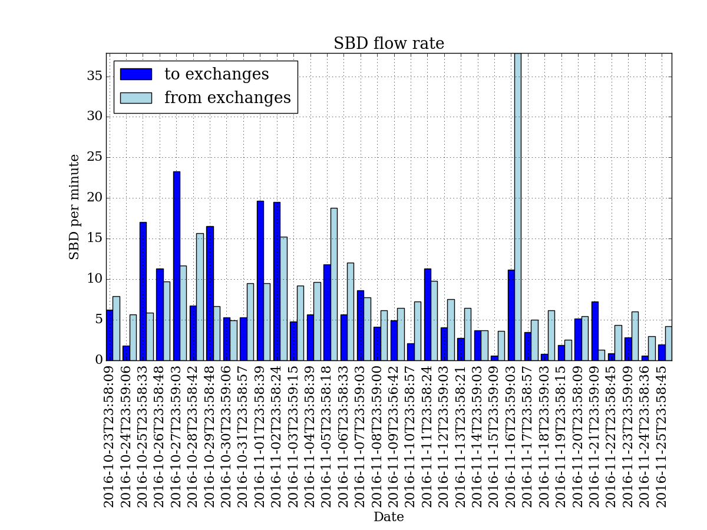
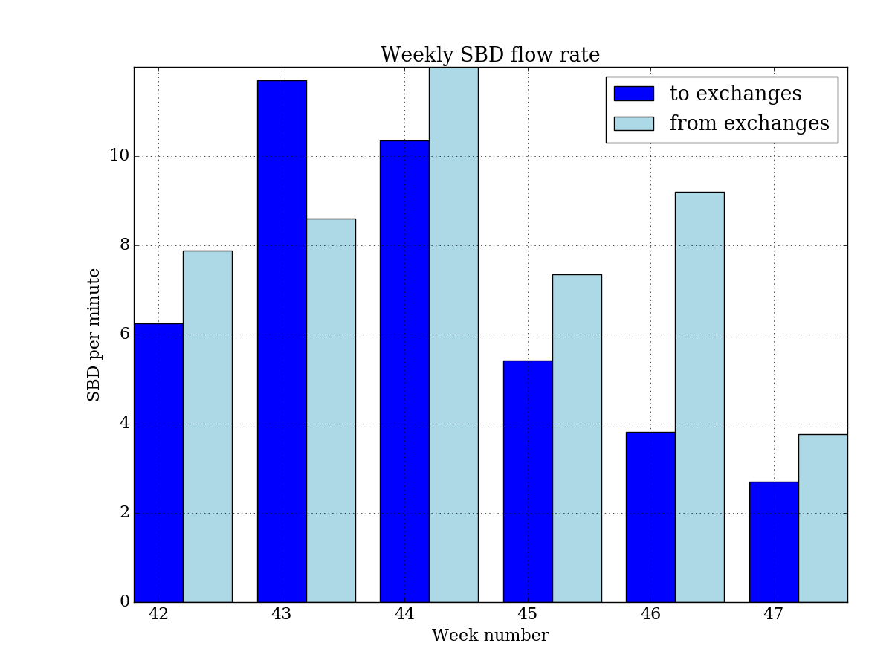
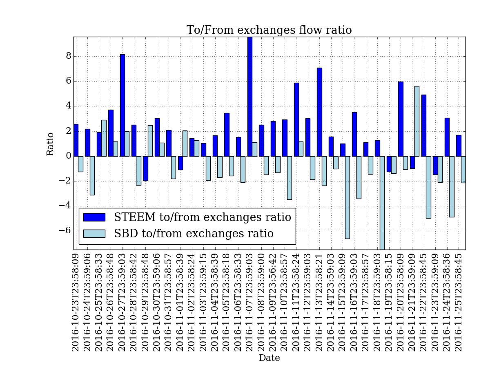
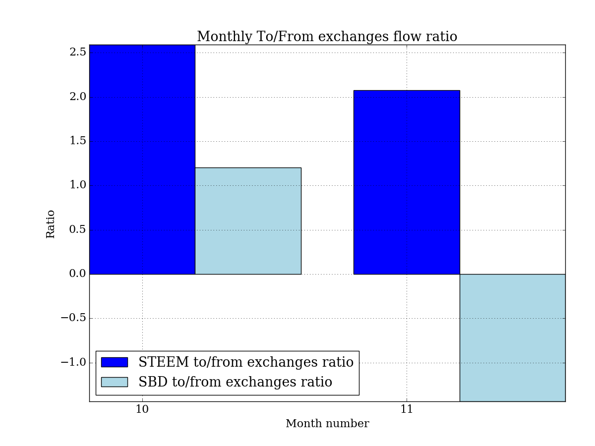
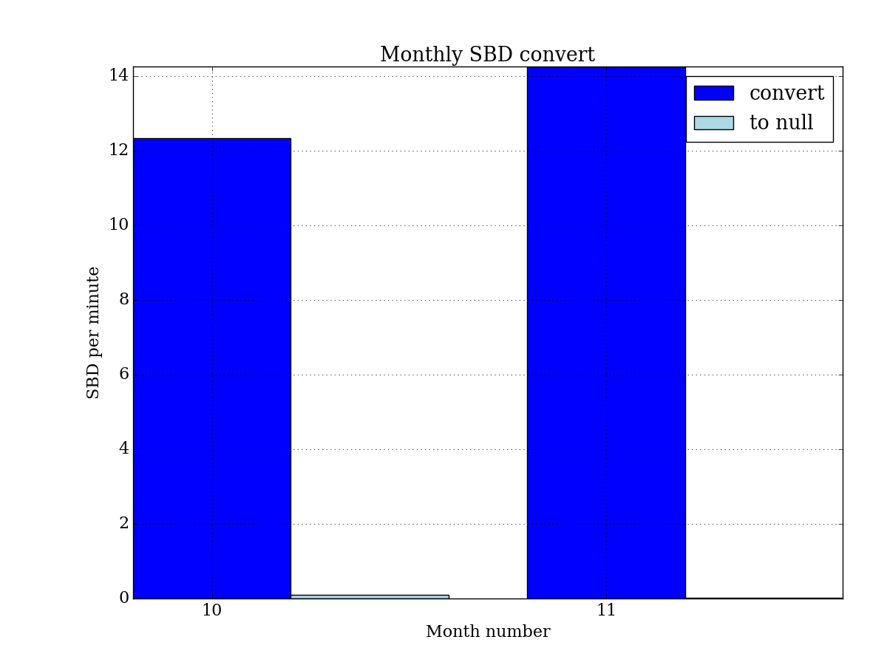
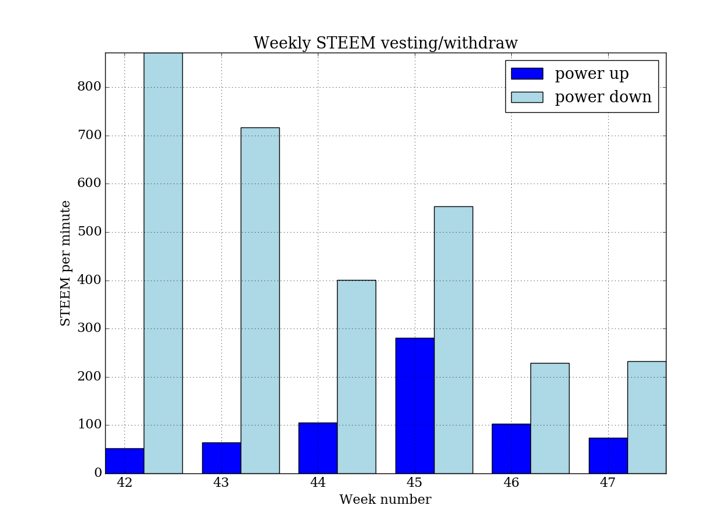
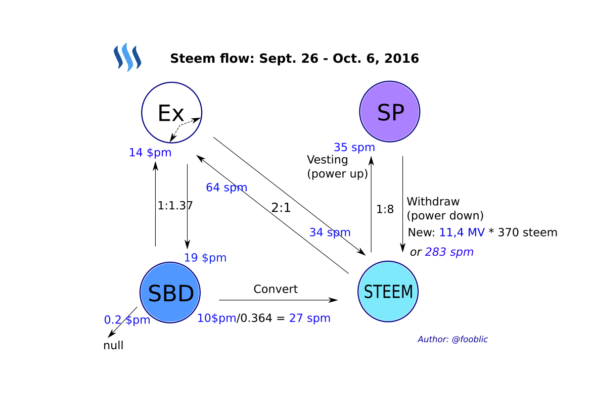

# STEEM flow

STEEM blockchain transaction monitoring tool:

* Calculate average STEEM & SBD flows intensity and ratio
* Store data in database (Redis DB)
* Display stored data over web-server (Twisted framework)
* Plot statistics graphics (Pandas, Matplotlib)

[https://steemit.com/@fooblic](https://steemit.com/@fooblic)



## steem_flow2

Collect average STEEM flow intensity data for certain days, certain blocks or from last stored block in Redis DB:
```
$ ./steem_flow2.py
Usage: ./steem_flow2.py [options]
  options:
    --days <n>               parse blocks for <n> last days 
    --blocks <start> <end>   parse blocks numbers from <start> to <end>
    --redis                  parse blocks from last one in Redis DB 
```
It is convenient to start the script by cron every day at 0:00.

The data in Redis DB is arranged as follow by slots with names "steem:start_block:stop_block" and score "end_block":
```
fooblic@vps:~$ redis-cli
127.0.0.1:6379> zrange steem:blocks 0 -1 withscores
 1) "steem:6068640:6097440"
 2) "6097440"
 3) "steem:6097426:6126232"
 4) "6126232"
...
25) "steem:6413802:6442575"
26) "6442575"
27) "steem:6442576:6471371"
28) "6471371"
```

### Simple web-server
Display flow data from Redis DB:
```
$ ./steem_web.py &
http://localhost:8787/steemslots

1. steem:6068640:6097440    2016-10-22T23:58:21 - 2016-10-23T23:58:09
2. steem:6097426:6126232    2016-10-23T23:58:12 - 2016-10-24T23:59:06
3. steem:6126233:6155023    2016-10-24T23:59:09 - 2016-10-25T23:58:33
```

Statistics from certain slot:
```
block_interval: 3 
 from_last_block: 5662618 timestamp: 2016-10-08T21:23:33 

 parsed_block: 5896622 (#234004) time_stamp: 2016-10-17T00:29:18 (8 days, 3:05:45, 11705.8 minutes passed) 

 pow2_count: 11149 (avg: 21.0 blocks), each 0:01:02.996233 

 total transfers: 9443 including: 
 to_exchange: 1872 (989533.0 STEEM @ 84.5 spm, 131602.2 SBD @ 11.2 $pm) 
 from_exchange: 740 (526254.3 STEEM @ 45.0 spm, 142357.1 SBD @ 12.2 $pm) 
 to/from exchange ratio: 1.88:1 STEEM, 0.92:1 SBD 
 between_users: 5685 
 between_exchanges: 403 
 to_null: 743 (1651.0 SBD) @ 0.1 $pm 

 vesting: 4436 (516711.3 STEEM) @ 44.1 spm 
 new withdraw: 270 (7492.2 MV) @  0.64 MV per min 

 convert: 270 (149806.0 SBD) @ 12.8 $pm 
 feed base: 3977 (0.264 SBD), each 0:02:56.502892
```

spm - STEEM per minute

$pm - SBD per minute

### Export data and plot graphics

Export data from Redis to Python pickle file `store.pkl` from start to end block:
```
fooblic@vps:~$ ./steem/flow_data_export.py 6068640 6471371
```
The data exported and saved as a Pandas dataframe.

Plot statistics graphics from dataframe with Python matplotlib:
```
$ ./steem_plot.py
```



















## steem_flow.py

Online transaction monitoring starting from last block in STEEM blockchain and calculate average STEEM & SBD flows intensity and ratio.

Update collected data to index.html file for each interval.

Output example:
```
block_interval: 3 
 from_last_block: 5116714 timestamp: 2016-09-19T21:34:48 

 current_block: 5144306 (#27592) time_stamp: 2016-09-20T20:41:30 (23:06:42, 1386.7 minutes passed) 

 pow2_count: 1314 (avg: 21.0 blocks), each 0:01:03.319635 

 transfers: 1110 
 to_exchange: 184 (71911.2 STEEM @ 51.9 spm, 43166.3 SBD @ 31.1 $pm) 
 from_exchange: 90 (46337.0 STEEM @ 33.4 spm, 20274.0 SBD @ 14.6 $pm) 
 to/from exchange ratio: 1.6:1 STEEM, 2.1:1 SBD 
 between_users: 670 
 between_exchanges: 43 
 to_null: 123 (408.4 SBD) @ 0.3 $pm 

 vesting: 220 (43179.8 STEEM) @ 31.1 spm 
 new withdraw: 41 (498.3 mVESTS) @ 475.4 VESTS per min 

 convert: 50 (12847.0 SBD) @ 9.3 $pm 
 feed base: 256 (0.440 SBD), each 0:05:23.824219
```

Graphical representation of STEEM blockchain flows:


```
block_interval: 3 
 from_last_block: 5300787 timestamp: 2016-09-26T07:39:24 

 current_block: 5597757 (#296970) time_stamp: 2016-10-06T15:19:33 (10 days, 7:40:09, 14860.1 minutes passed) 

 pow2_count: 14347 (avg: 20.7 blocks), each 0:01:02.146024 

 transfers: 11436 
 to_exchange: 2195 (950443.0 STEEM @ 64.0 spm, 205044.0 SBD @ 13.8 $pm) 
 from_exchange: 681 (501884.6 STEEM @ 33.8 spm, 279145.7 SBD @ 18.8 $pm) 
 to/from exchange ratio: 1.89:1 STEEM, 0.73:1 SBD 
 between_users: 6979 
 between_exchanges: 486 
 to_null: 1095 (3269.9 SBD) @ 0.2 $pm 

 vesting: 3214 (526521.3 STEEM) @ 35.4 spm 
 new withdraw: 613 (11369.6 MV) @   VESTS per min

 convert: 475 (147044.6 SBD) @ 9.9 $pm 
 feed base: 3174 (0.364 SBD), each 0:04:40.874291
```

