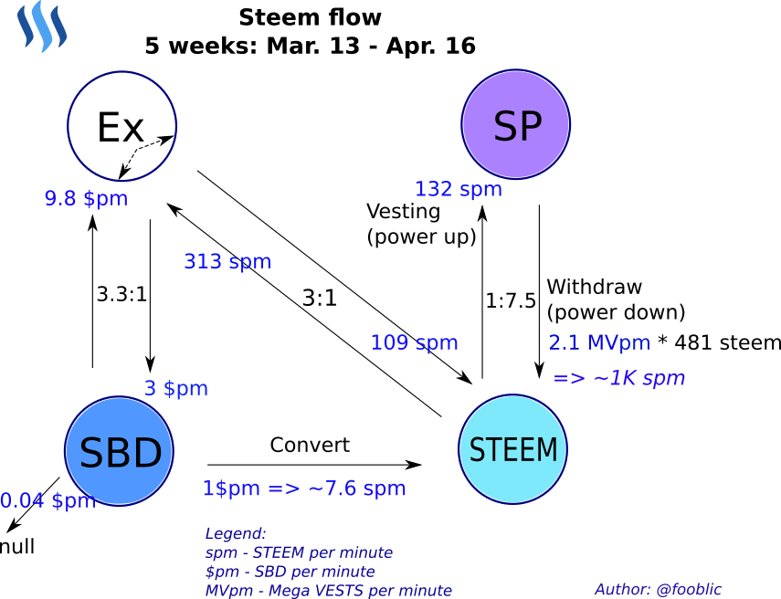
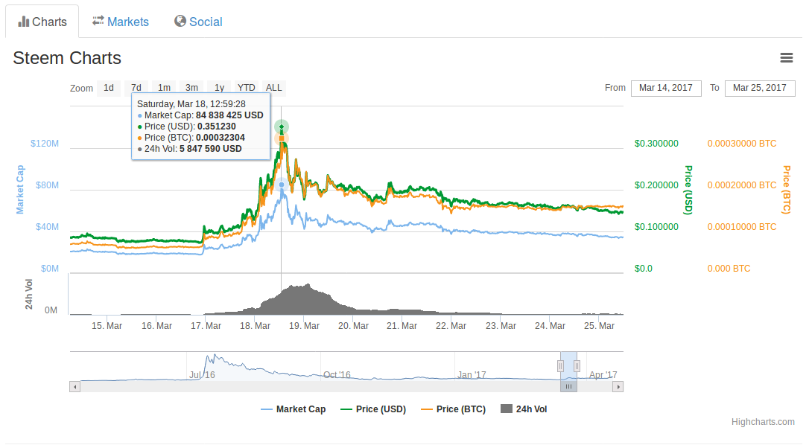
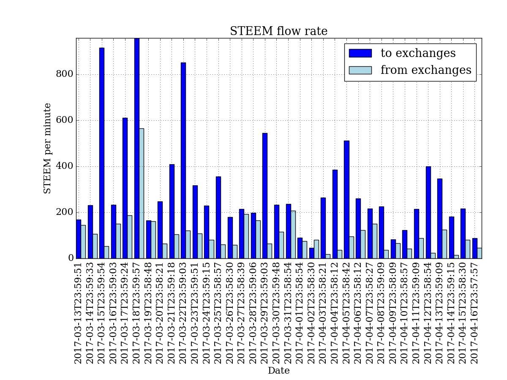
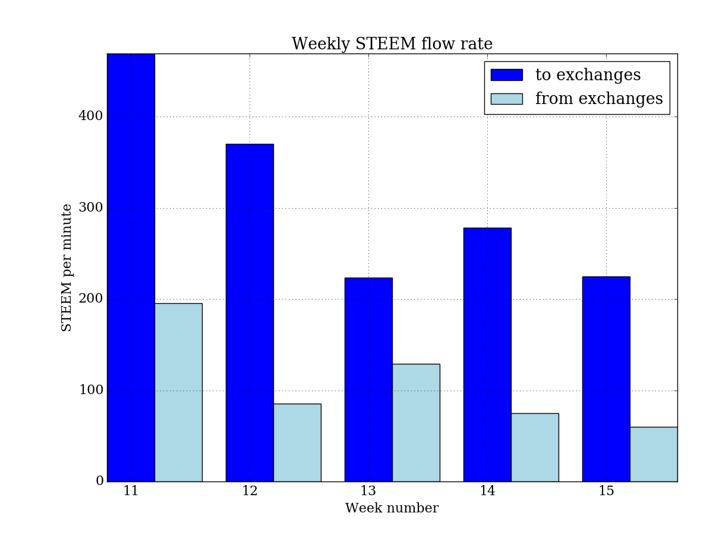
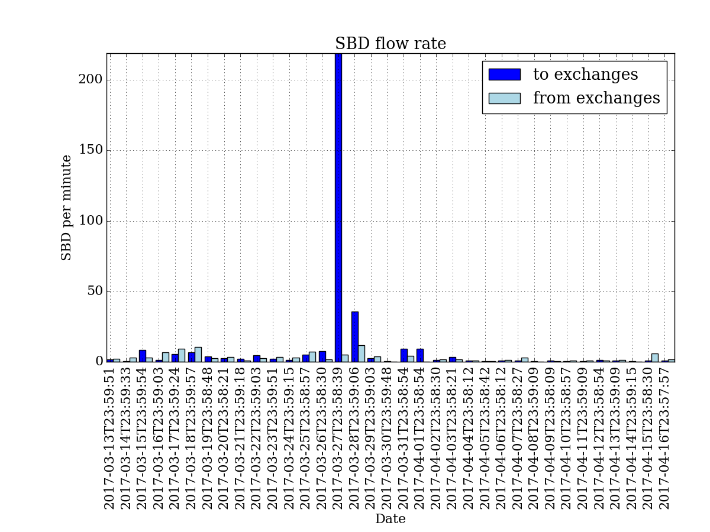
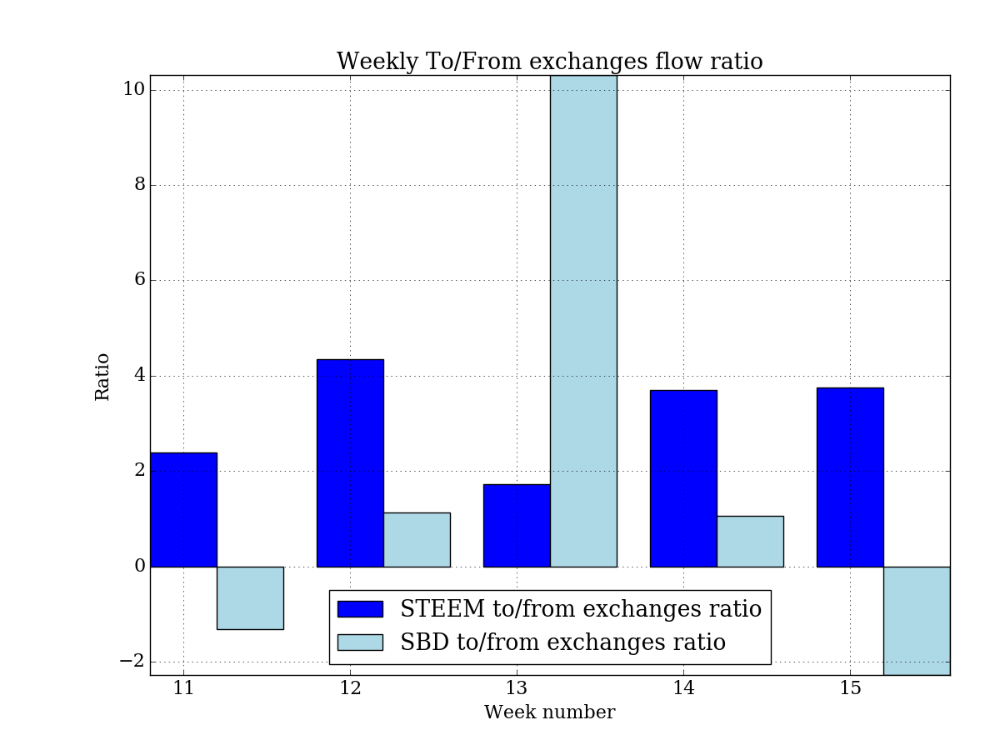
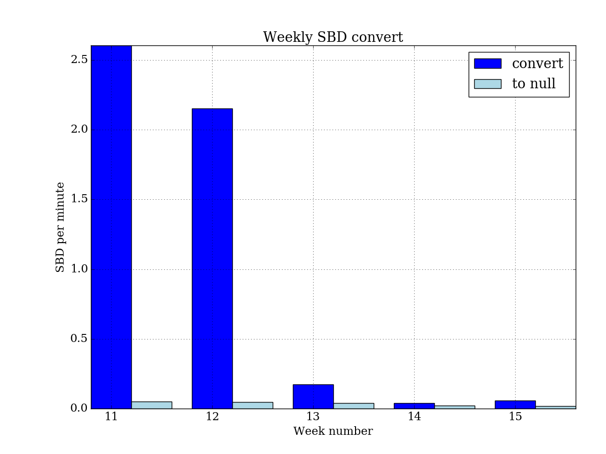
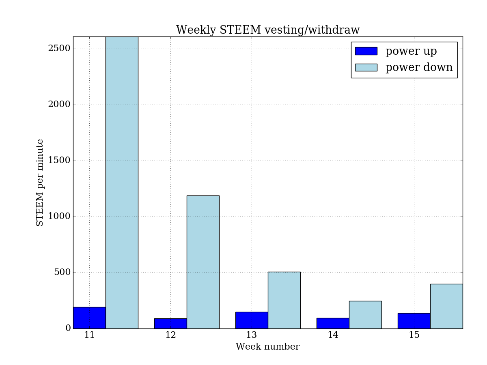

# STEEM flow report

Average STEEM flow intensity for last 5 weeks:



My previous report -> [steem-flow-3](https://steemit.com/stats/@fooblic/steem-flows-3)

The end of March was prominent as STEEM price pike up to 0.35 USD (March, 18) after 3 month of continuous decline since last December peak. The growth began on March, 16 from 0.076 USD, so the price has jumped up on 460%. A day before (March, 15) Steemians was alarmed with @dan resign post - [Today I submitted my Resignation to Steemit, inc](https://steemit.com/steem/@dan/today-i-submitted-my-resignation-to-steemit-inc). 



Price charts source: [coinmarketcap.com](http://coinmarketcap.com/currencies/steem/)

On March, 30 was one more serious event: Hardfork 17&18 - [Annoucing Steem Hardfork 18](https://steemit.com/steemit/@steemitguide/annoucing-steem-hardfork-18-keep-up-with-latest-updates-and-features-of-version-0-18-1-infographics). A lot of rules was changed and among other things as reset of posting reward pool, the PoW confirmation was omitted.

PoW count before March 30 per day was a PoW per 20 blocks of each 1 min:
```
pow2_count: 1432 (avg: 20.0 blocks), each 0:01:00
```
There is no PoW in blockchain at all after March, 30:
```
pow2_count: 0 (avg: 0.0 blocks), each 0 
```

There were significant STEEM flow intensity to exchanges on 15th, 18th and 22nd of March on daily flow diagram. On March, 18 was sizeable STEEM splash in opposite direction from exchanges as well that could be cause of STEEM price increase. It looks like Dan took out STEEM to exchange and somebody bought it.



After a short splash STEEM activity goes down. 



SBD flow intensity was low except of March, 27 with a single peak to exchange direction.  







It was some small activity in SBD blockchain conversion to STEEM, but then it went down.


SP withdrawals prevails as usual.



###All source code on Python is available on [github](https://github.com/fooblic/steem-flow).